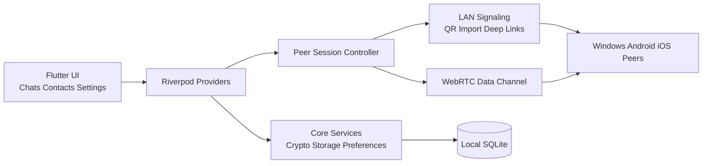

# GungChat —— 敢说
## 目前最安全的点对点加密通讯应用程序：100%保密、完全隐私、无用户数据泄露、无登录、无服务器依赖、点对点、完全匿名、数据加密、无广告、无追踪、完全自主控制、短信、语音通话、视频通话、开源免费。
## The ultimate private messenger: 100% confidential, zero accounts, zero servers, zero tracking. Pure peer‑to‑peer encryption for text, voice, and video. Anonymous, ad‑free, open‑source, and completely free—privacy without compromise. No tracking, no ads, just secure communication with total freedom.


[](https://flutter.dev)
[](#major-features)
[](gungchat/pubspec.yaml)

Privacy-first peer-to-peer messaging built with Flutter.

[中文说明](README.zh-CN.md) | [Technical notes](README.TECH.md)

## Repo Layout

- `./gungchat` contains the Flutter application.
- root-level `SESSION_*.md` and plan files contain project notes and handoff context.
- `./gungchat/installer` contains the Windows installer script.

If you want to build or debug the app, start in `./gungchat`.

## Major Features

- Peer-to-peer chat foundations built with Flutter and WebRTC.
- Contact exchange through QR and contact payload import flows.
- Chat, contacts, and settings screens for desktop and mobile targets.
- File, image, audio, and location sharing with media gallery support.
- Privacy-focused features such as app lock, local storage, and contact controls.
- Windows desktop build and installer packaging, plus Android release APK packaging.

## Architecture At A Glance



## Quick Start

Run all commands below from `./gungchat`.

### Install Dependencies

```bash
flutter pub get
```

### Validate The Project

```bash
flutter analyze
flutter test
```

### Run On Windows

```powershell
flutter run -d windows
```

### Build Windows Release

```powershell
flutter build windows
```

Output:

- `gungchat/build/windows/x64/runner/Release/`

### Build Windows Installer

```powershell
& "$env:LOCALAPPDATA\Programs\Inno Setup 6\ISCC.exe" ".\installer\gungchat.iss"
```

Output:

- `gungchat/installer/output/gungchat-setup-<version>.exe`

### Build Android APK

```powershell
flutter build apk --release
```

Output:

- `gungchat/build/app/outputs/flutter-apk/`

### Build iOS

iOS builds require macOS and Xcode.

```bash
flutter build ios
```

You can also open `gungchat/ios/Runner.xcworkspace` in Xcode for signing and device testing.

## How To Test

- Automated checks: `flutter analyze` and `flutter test`
- Windows smoke test guide: [gungchat/WINDOWS_11_BUILD_AND_SMOKE_TEST.md](gungchat/WINDOWS_11_BUILD_AND_SMOKE_TEST.md)
- Manual cross-device test guide: [gungchat/PHASE_9_7_MANUAL_TEST_CHECKLIST.md](gungchat/PHASE_9_7_MANUAL_TEST_CHECKLIST.md)
- Deeper technical background: [README.TECH.md](README.TECH.md)

## Help Wanted

We need more contributors, especially Apple developers.

We especially need help with:

- building the iOS target on macOS with Xcode
- testing on real iPhone and iPad hardware
- validating permissions, local auth, file flows, and chat behavior on iOS
- debugging signing, device deployment, and App Store readiness issues
- cross-platform Windows and Android chat testing
- WebRTC and peer connectivity debugging

If you want to help, please open an issue or send a pull request.
