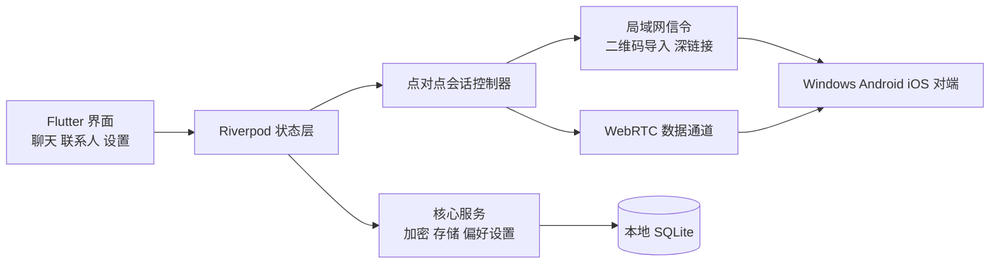

# GungChat —— 敢说

[](https://flutter.dev)
[](#主要功能)
[](gungchat/pubspec.yaml)

## 目前最安全的点对点加密通讯应用程序：100%保密、完全隐私、无用户数据泄露、无登录、无服务器依赖、点对点、完全匿名、数据加密、无广告、无追踪、完全自主控制、短信、语音通话、视频通话、开源免费。

一个基于 Flutter 构建、强调隐私和点对点通信的聊天应用。

[English](README.md) | [技术说明](README.TECH.md)

## 仓库内容

- `./gungchat` 是 Windows、Android、iOS 共用的 Flutter 应用主体。
- 根目录下的 `SESSION_*.md` 和计划文档用于保存项目说明与交接背景。
- `./gungchat/installer` 包含 Windows 安装包脚本。

如果你要参与开发，请从 `./gungchat` 目录开始。

## 主要功能

- 基于 Flutter 和 WebRTC 的点对点聊天架构。
- 通过二维码或联系人载荷导入来交换联系人信息。
- 面向桌面和移动端的聊天、联系人、设置界面。
- 文件、图片、音频、位置分享，以及会话媒体库。
- 注重隐私的能力，例如应用锁、本地存储、联系人管理。
- Windows 桌面构建与安装包流程，以及 Android 发布 APK 打包。

## 架构概览



## 快速开始

以下命令都在 `./gungchat` 目录下执行。

### 安装依赖

```bash
flutter pub get
```

### 基础校验

```bash
flutter analyze
flutter test
```

### 在 Windows 上运行

```powershell
flutter run -d windows
```

### 构建 Windows Release

```powershell
flutter build windows
```

输出目录：

- `gungchat/build/windows/x64/runner/Release/`

### 生成 Windows 安装包

```powershell
& "$env:LOCALAPPDATA\Programs\Inno Setup 6\ISCC.exe" ".\installer\gungchat.iss"
```

输出目录：

- `gungchat/installer/output/gungchat-setup-<version>.exe`

### 构建 Android APK

```powershell
flutter build apk --release
```

输出目录：

- `gungchat/build/app/outputs/flutter-apk/`

### 构建 iOS

iOS 构建需要 macOS 和 Xcode。

```bash
flutter build ios
```

也可以用 Xcode 打开 `gungchat/ios/Runner.xcworkspace` 做签名与真机测试。

## 如何测试

- 自动化检查：`flutter analyze` 与 `flutter test`
- Windows 冒烟测试指南： [gungchat/WINDOWS_11_BUILD_AND_SMOKE_TEST.md](gungchat/WINDOWS_11_BUILD_AND_SMOKE_TEST.md)
- 跨设备手工测试指南： [gungchat/PHASE_9_7_MANUAL_TEST_CHECKLIST.md](gungchat/PHASE_9_7_MANUAL_TEST_CHECKLIST.md)
- 更详细的技术背景： [README.TECH.md](README.TECH.md)

## 需要帮助

项目目前很需要更多开发者参与，尤其是 Apple / iOS 开发者。

当前最需要的帮助包括：

- 在 macOS + Xcode 上构建 iOS 版本
- 在真实 iPhone / iPad 设备上进行测试
- 验证权限、本地认证、文件流程和聊天行为在 iOS 上是否稳定
- 协助处理签名、真机部署和 App Store 准备问题
- Windows 与 Android 的跨平台聊天联调
- WebRTC 与点对点连接问题排查

如果你愿意参与，请提交 issue 或 pull request。

[](https://github.com/gungwang/gungchat/releases)